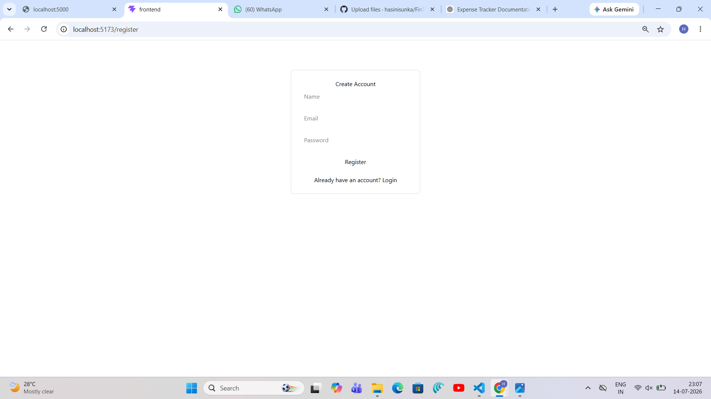
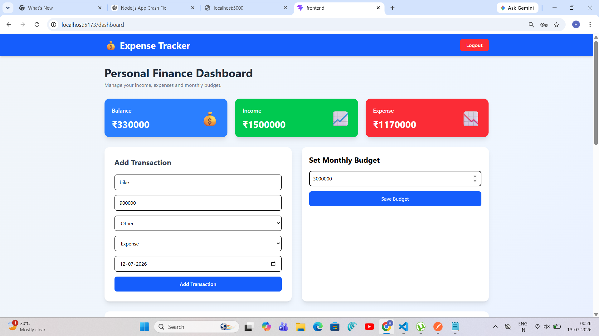
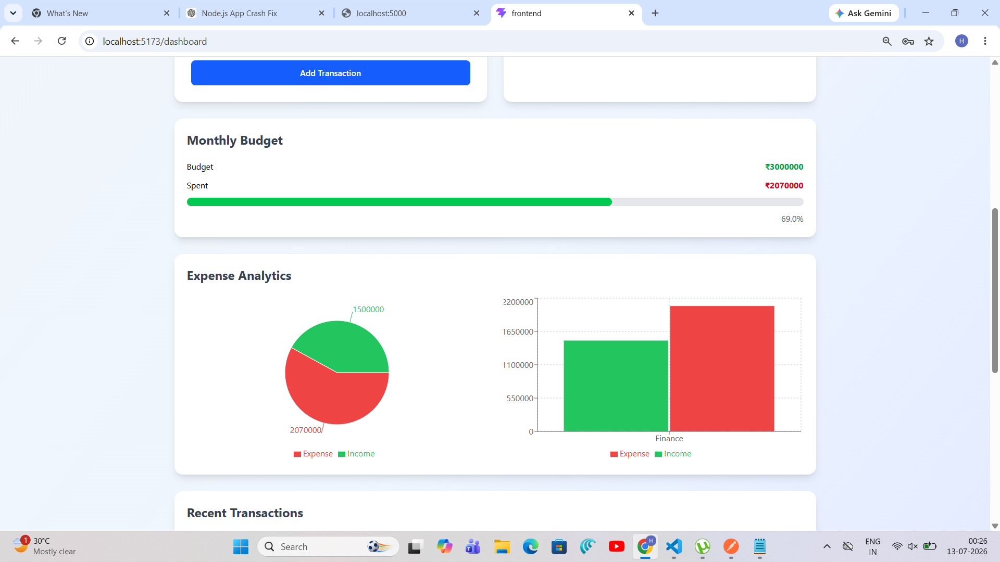
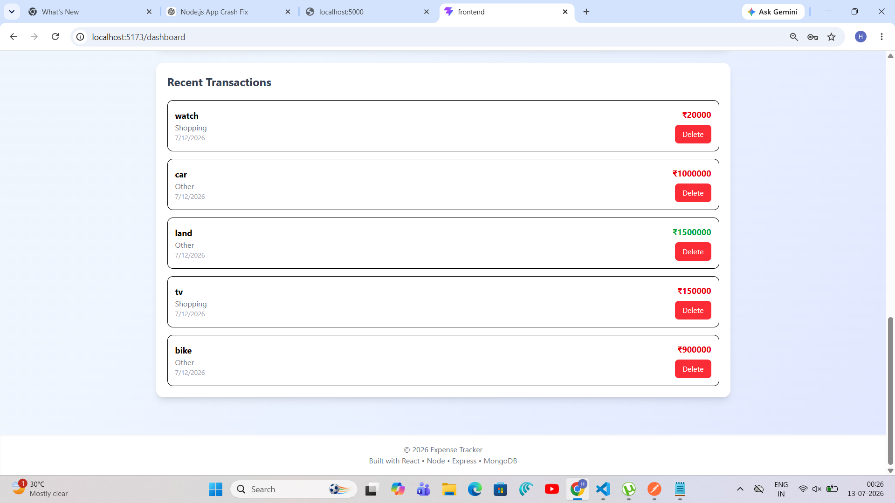

# 💰 Expense Tracker (MERN Stack)

A full-stack Expense Tracker application built using the **MERN Stack (MongoDB, Express.js, React.js, Node.js)**. The application allows users to securely manage their personal finances by tracking income and expenses, viewing transaction history, and monitoring their financial summary.

---

## 🚀 Features

- 🔐 User Authentication (Register/Login)
- 🔑 JWT-based Authorization
- 🔒 Password Hashing using bcrypt
- ➕ Add Income and Expense Transactions
- 🗑️ Delete Transactions
- 📋 View Transaction History
- 📊 Dashboard with:
  - Total Income
  - Total Expenses
  - Current Balance
- 📅 Date-wise Transaction Records
- 📱 Responsive User Interface
- ☁️ MongoDB Atlas Database

---

## 🛠️ Tech Stack

### Frontend
- React.js
- React Router DOM
- Axios
- Tailwind CSS

### Backend
- Node.js
- Express.js

### Database
- MongoDB Atlas

### Authentication
- JWT (JSON Web Token)
- bcryptjs

---

## 📂 Project Structure

```
Expense-Tracker/
│
├── backend/
│   ├── config/
│   ├── controllers/
│   ├── middleware/
│   ├── models/
│   ├── routes/
│   ├── server.js
│   ├── package.json
│   └── .env
│
├── frontend/
│   ├── public/
│   ├── src/
│   │   ├── components/
│   │   ├── pages/
│   │   ├── services/
│   │   ├── App.jsx
│   │   └── main.jsx
│   └── package.json
│
├── README.md
└── .gitignore
```

---

## Screenshots

### Login Page

### Register Page


### Dashboard Page


### Graphs and Charts


### Transactions


---

## ⚙️ Installation

### 1️⃣ Clone the Repository

```bash
git clone https://github.com/your-username/Expense-Tracker.git
```

---

### 2️⃣ Backend Setup

```bash
cd backend
npm install
```

Create a `.env` file inside the backend folder.

```env
PORT=5000

MONGO_URI=your_mongodb_connection_string

JWT_SECRET=your_secret_key
```

Start the backend server.

```bash
npm run dev
```

---

### 3️⃣ Frontend Setup

```bash
cd frontend
npm install
npm run dev
```

The frontend will run on:

```
http://localhost:5173
```

The backend will run on:

```
http://localhost:5000
```

---

## 📡 API Endpoints

### Authentication

| Method | Endpoint | Description |
|---------|----------|-------------|
| POST | `/api/auth/register` | Register User |
| POST | `/api/auth/login` | Login User |

---

### Transactions

| Method | Endpoint | Description |
|---------|----------|-------------|
| GET | `/api/transactions` | Get All Transactions |
| POST | `/api/transactions` | Add Transaction |
| DELETE | `/api/transactions/:id` | Delete Transaction |

---

### Dashboard

| Method | Endpoint | Description |
|---------|----------|-------------|
| GET | `/api/dashboard` | Dashboard Summary |

---

## 🗃️ Database Schema

### User

```javascript
{
  name: String,
  email: String,
  password: String
}
```

### Transaction

```javascript
{
  user: ObjectId,
  title: String,
  amount: Number,
  category: String,
  type: "Income" | "Expense",
  date: Date
}
```

---

## 🔒 Authentication Flow

1. User registers with name, email, and password.
2. Password is hashed using bcrypt.
3. User logs in.
4. Server generates a JWT token.
5. Token is stored in Local Storage.
6. Protected routes verify the token before granting access.

---

## 🌟 Future Enhancements

- 📈 Expense Analytics Dashboard
- 📊 Charts using Chart.js
- 💸 Budget Planning
- 📄 Export Reports (PDF/Excel)
- 🌙 Dark Mode
- 🔔 Email Notifications
- 📱 Progressive Web App (PWA)
- 🔍 Search & Filter Transactions
- 📅 Monthly and Yearly Reports

---

## 👨‍💻 Author

**SUNKA HASINI**

B.Tech Computer Science Engineering

GitHub: https://github.com/your-username

LinkedIn: https://linkedin.com/in/your-profile

---

## 📄 License

This project is licensed under the MIT License.

---
